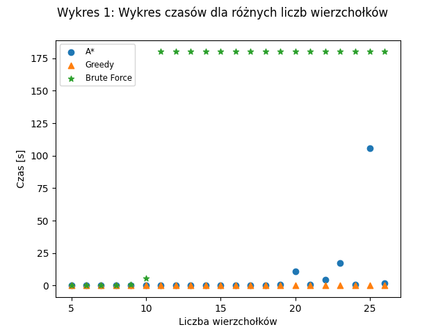
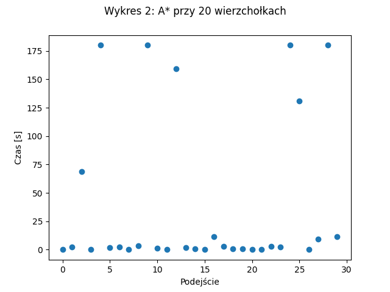
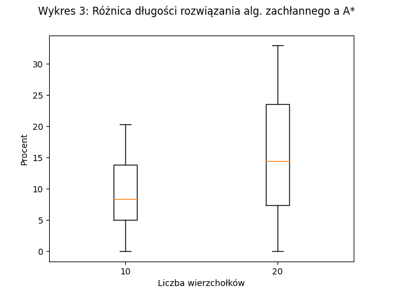

# Zadanie MM.P1
"Zaimplementować i przetestować algorytm A\* dla problemu komiwojażera. Porównać działanie algorytmu A\* z algorytmem zachłannym i przeszukiwaniem brute force (dla bf przerwać obliczenia w pewnym momencie). WE: plik ze współrzędnymi punktów. WY: najkrótszy cykl łączący punkty."

# Przyjęte założenia

## Format pliku wejściowego
Każdy punkt zapisany w osobnej linijce w postaci wartości współrzędnych (liczba zmiennoprzecinkowa) oddzielonych spacją. Pierwszy punkt jest punktem startowym.
```
0 0
1 0.5
10.15 14.1
...
```

## Wybrany język
Python wersja 3.

## Doprecyzowanie treści
Każdy punkt w pliku wejściowym to jeden wierzchołek grafu. Każdy wierzchołek łączy się ze wszystkimi pozostałymi (graf pełny), a waga danej krawędzi to odległość między
łączonymi punktami w układzie współrzędnych.

## Podział zadań

- implementacja heurystyki \- Maciej Dmowski
- implementacja algorytmu A* \- Adam Szałowski, Maciej Dmowski
- implementacja algorytmu zachłannego i brute force \- Maciej Dmowski
- przeprowadzenie eksperymentów \- Adam Szałowski
- wizualizacja wyników eksperymentów \- Adam Szałowski
- wnioski \- Adam Szałowski, Maciej Dmowski

# Opis algorytmu

Aby móc zaaplikować algorytm A\* do rozwiązania problemu komiwojażera nie możemy rozpatrywać wierzchołków i krawędzi bezpośrednio lecz pewne 'stany' rozwiązania. 
Zdefiniujemy sobie więc pojęcia stanu dla naszego problemu jako  
dotychczasową ścieżkę czyli listę odwiedzonych już elementów w kolejności ich odwiedzania. 
Dla tak zdefiniowanego stanu możemy określić kilka ważnych elementów algorytmu:

- **Stan początkowy**: ścieżka składająca się tylko z elementu początkowego
- **Stan końcowy**: ścieżka zawierająca każdy wierzchołek grafu jednokrotnie (brak cyklów)
- **Następcy stanu**: wszystkie stany, które da się uzyskać poprzez przejście z ostatniego wierzchołka ścieżki do jego sąsiadów

Mają te elementy możemy zapisać kroki algorytmu:

1. Stan początkowy umieszczamy w zbiorze otwartych stanów - openStates.
2. Wybieramy stan s z openStates, który ma minimalną wartość funkcji *F(state)* i przenosimy go do zbioru zamkniętych wierzchołków - closedStates.
3. Jeżeli s jest stanem końcowym kończymy działanie algorytmu. Rozwiązaniem problemu jest cykl utworzony ze ścieżki stanu s poprzez dodanie na jej koniec elementu początkowego.
4. Do openStates dodajemy wszystkich następców stanu s.

By móc zaimplementować ten algorytm pozostaje nam zdefiniowanie funkcji *F(state)* jako:
$$F(state) = g(state) + h(state)$$ 
, gdzie *g(state)* to długości ścieżki stanu czyli suma wag krawędzi pomiędzy kolejnymi elementami ścieżki 
natomiast *h(state)* to wybrana przez nas heurystyka, która usprawni wyszukiwanie odpowiednich stanów. 
Dla problemu komiwojażera zdecydowaliśmy, że dobrym rozwiązaniem będzie to 
suma krawędzi minimalnego drzewa rozpinającego utworzonego z nieodwiedzonych wierzchołków 
plus minimalne wagi krawędzi łączących krańce tego drzewa z początkowym i końcowym elementem ścieżki.

# Analiza

## Przeprowadzone testy

Dla sprawdzenia i porównania jakości zaimplementowanych algorytmów dla każdego z nich zebraliśmy następujące dane:

- czas rozwiązania problemu ( czas od momentu uruchomienia do zakończenia działania funkcji )
- długość wyznaczonego cyklu
- liczba odwiedzonych stanów

Testy można podzielić na dwa etapy:

1. Dla liczby wierzchołków od 5 do 26 generowaliśmy zestaw danych i każdy z nich przekazywaliśmy do każdego z algorytmów.
2. Dla liczby wierzchołków 10 oraz 20 generowaliśmy po 30 zestawów danych i przekazywaliśmy je do algorytmu A\* oraz zachłannego.

W trakcie przeprowadzania testów jeżeli czas działania algorytmu przekroczył dla konkretnych danych czas 180 s. kończyliśmy jego działania.

## Wykresy

{ width=50% }

{ width=50% }\ { width=50% }


## Wnioski
Na podstawie wykresu 1. pierwszego możemy stwierdzić, że zgodnie z przypuszczeniami najbardziej wydajny czasowo jest algorytm zachłanny jednakże zaimplementowany przez nas algorytm A\* dla liczby wierzchołków nie przekraczającej 20 jest bardzo zbliżony. Dla większych zestawów danych zaczyna odbiegać od zachłannego ale i tak wykazuje znaczną przewagę nad algorytmem brute force.

Analizując wykres 2. możemy zauważyć, że przy naszym algorytmie czas znalezienia rozwiązania jest zależny nie tylko od liczby wierzchołków ale także od ich ułożenia. Rozbieżności są na tyle duże, że dla niektórych danych czas zwiększa się o kilka rzędów wielkości. W takich przypadkach przypuszczamy, że ułożenie wierzchołków powoduje, że funkcja heurystyki oparta o minimalne drzewo rozpinające nie zmienia się dla kolejnych stanów przez co algorytm przez pewien czas zaczyna zachowywać się podobnie do brute force.

Pomimo tego, że algorytm zachłanny jest bardziej wydajny czasowo to nie zawsze wyznacza rozwiązanie optymalne. Z wykresu 3. możemy odczytać, że rozwiązania zwracane przez algorytm zachłanny są gorsze od A\* od kilku do kilkudziesięciu procent ale zdarzają się też pojedyncze przypadki gdzie rozwiązania są równe. Na podstawie danych możemy zauważyć, że im więcej wierzchołków tym różnica procentowa jest większa.

Czas znalezienia rozwiązania przy użyciu A\* zależy od jakości zastosowanej funkcji heurystycznej więc chcąc poprawić algorytm należałoby się skupić na ulepszeniu heurystyki. W trakcie realizacji projektu udoskonalaliśmy ją kilkukrotnie.

# Instrukcja używania

## Wymagania
Do samego uruchomienia programów nie są potrzebne żadne dodatkowe biblioteki. Jeśli jednak potrzebne byłoby ponowne wygenerowanie danych za pomocą modułu *runTests.py* wymagane jest zainstalowanie biblioteki [pandas](https://pandas.pydata.org/). Analogicznie do wygenerowania wykresów ( plik *analysis.ipyn* ) potrzebna jest biblioteka [matplotlib](https://matplotlib.org/) oraz program [jupyter](https://jupyter.org/index.html).

## Uruchomienie dla pliku wejściowego
- Algorytm A*: python3 astar.py plik_z_wierzcholkami.txt
- Algorytm zachłannego: python3 greedy.py plik_z_wierzcholkami.txt
- Algorytm brute force: python3 bruteForce.py plik_z_wierzcholkami.txt

Przykładowe dane znajdują się w katalogu *data*.


