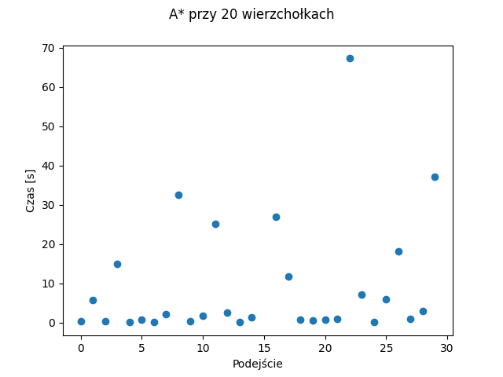
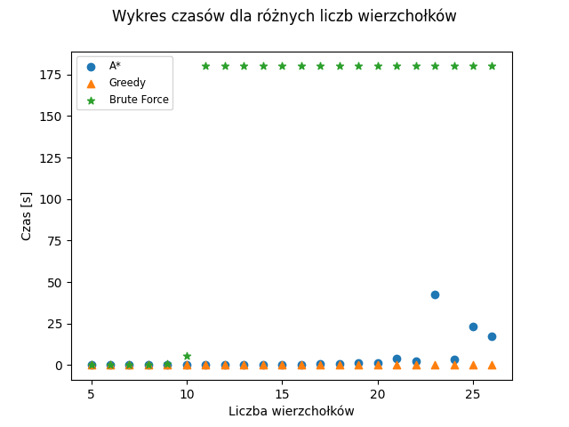
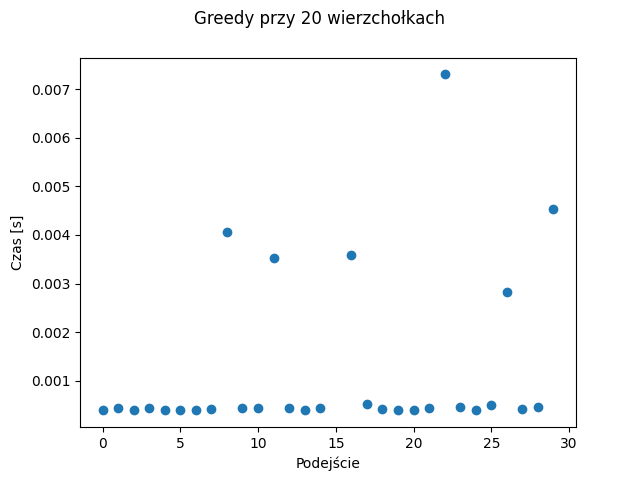

# Zadanie MM.P1
"Zaimplementować i przetestować algorytm A\* dla problemu komiwojażera. Porównać działanie algorytmu A\* z algorytmem zachłannym i przeszukiwaniem brute force (dla bf przerwać obliczenia w pewnym momencie). WE: plik ze współrzędnymi punktów. WY: najkrótszy cykl łączący punkty."

# Przyjęte założenia

## Format pliku wejściowego
Każdy punkt zapisany w osobnej linijce w postaci wartości współrzednych (liczba zmiennoprzecinkowa) oddzielonych spacją. Pierwszy punkt jest punktem startowym.
```
0 0
1 0.5
10.15 14.1
...
```

## Format pliku wyjściowego
Taki sam jak format pliku wejściowego. Punkty posortowane w kolejności ułożenia ich na ścieżce.

## Wybrany język
Python

## Doprecyzowanie treści
Każdy punkt w pliku wejściowym to jeden wierzchołek grafu. Każdy wierzchołek łączy się ze wszystkimi pozostałymi (graf pełny), a waga danej krawędzi to odległość między
łączonymi punktami w układzie współrzędnych.

## Podział zadań

### TODO
- export state to file - A
- implement greedy alg. - M
- implement brute force - M
- implement timing - A
- measure time for different algs. - A
- visualize - A
- conclusions - A,M

# Opis algorytmu

Aby móc zaaplikować algorytm A\* do rozwiązania problemu komiwojażera nie możemy rozpatrywać wierzchołków i krawędzi bezpośrednio lecz pewne 'stany' rozwiązania. 
Zdefiniujemy sobie więc pojęcia stanu dla naszego problemu jako  
dotychczasową ścieżkę czyli listę odwiedzonych już elementów w kolejności ich odwiedzania. 
Dla tak zdefiniowanego stanu możemy określić kilka ważnych elementów algorytmu:

- **Stan początkowy**: ścieżka składająca się tylko z elementu początkowego
- **Stan końcowy**: ścieżka zawierająca każdy wierzchołek grafu jednokrotnie (brak cyklów)
- **Następcy stanu**: wszystkie stany, które da się uzyskać poprzez przejście z ostatniego wierzchołka ścieżki do jego sąsiadów

Mają te elementy możemy zapisać kroki algorytmu:

1. Stan początkowy umieszczamy w zbiorze otwartych stanów - openStates.
2. Wybieramy stan s z openStates, który ma minimalną wartość funkcji *F(state)* i przenosimy go do zbiory zamkniętych wierzchołków - closedStates.
3. Jeżeli s jest stanem końcowym kończymy działanie algorytmu. Rozwiązaniem problemu jest cykl utworzony ze ścieżki stanu s poprzez dodanie na jej koniec elementu początkowego.
4. Do openStates dodajemy wszystkich następców stanu s.

By móc zaimplementować ten algorytm pozostaje nam zdefiniowanie funckji *F(state)* jako:
$$F(state) = g(state) + h(state)$$ 
, gdzie *g(state)* to długości ścieżki stanu czyli suma wag krawędzi pomiędzy kolejnymi elementami ścieżki natomiast *h(state)* to wybrana przez nas heurystyka, która usprawni wyszukiwanie odpowiednich stanów. Dla problemu komiwojażerazdecydowaliśmy, że dobrym rozwiązaniem będzie to suma krawędzi minimalnego drzewa rozpinającego utworzonego z nieodwiedzonych wierzchołków i minimalnych wag krawędzi łączacych krańce tego drzewa z początkowym i końcowym elementem ścieżki.

# Analiza

## Przeprowadzone testy

{ width=75% }

{ width=75% }

{ width=75% }


# Wnioski
-


